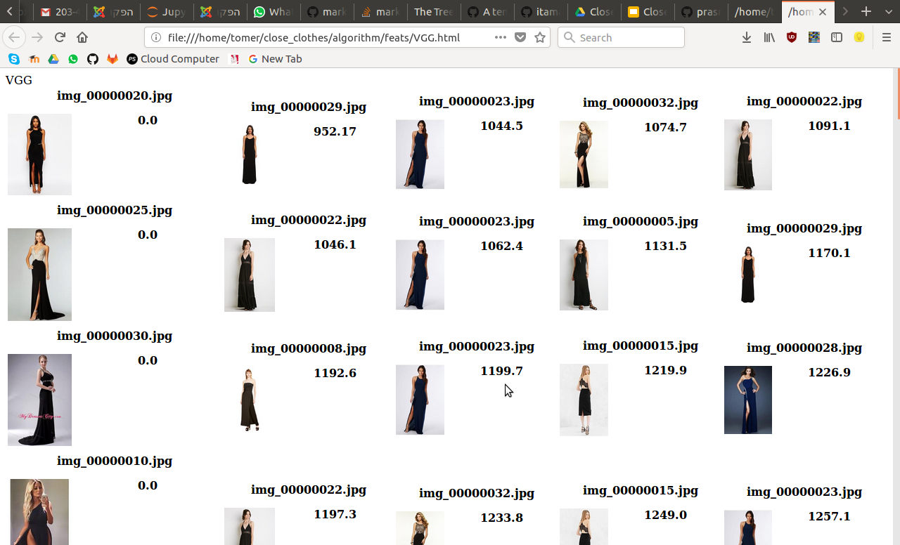

# CloseClothes
### An application for finding similar clothes from images using deep learning 

## Getting started:
<TODO>

## Project structure.
    ├── algorithm - All things deep learning
    │   ├── bbox - Tools for cropping the upper torso 
    │   ├── classification - Training our own network for clothing catagory classification
    │   ├── DeepFashion - The DeepFashion database used for training
    │   ├── feats -  Feature extraction and plotting
    │   ├── README.md
    │   ├── utils - External libraries 
    │   └── vgg_finetune
    ├── android - client-side android app
    ├── database - server-side 
    ├── __init__.py
    ├── main.py - project-wide main script
    ├── README.md
    ├── requirements.txt
    ├── scraping - tools for scraping real clothing products
    │   ├── phantomjs - phantomjs tool used by selenium for scraping
    ├── server - server for communicating with client android app

## Authors 
- Itamar Shenhar github: [itamar8910](www.github.com/itamar8910) - email: itamar8910@gmail.com
- Tomer Keren github: [Tadaboody](www.github.com/Tadaboody) - email: tomer.keren.dev@gmail.com
